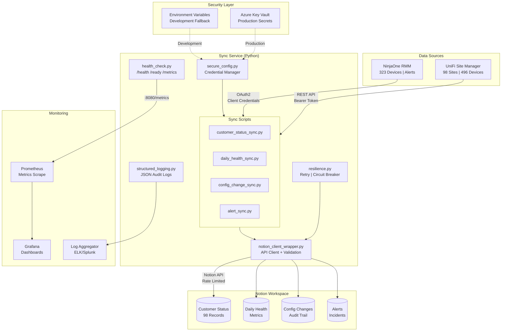
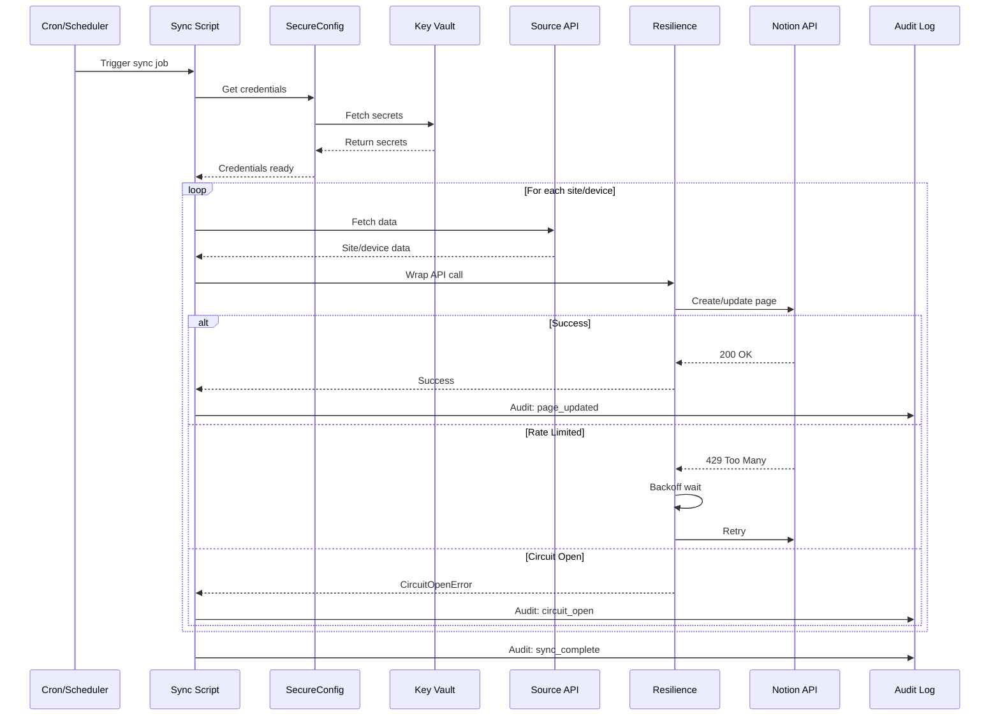
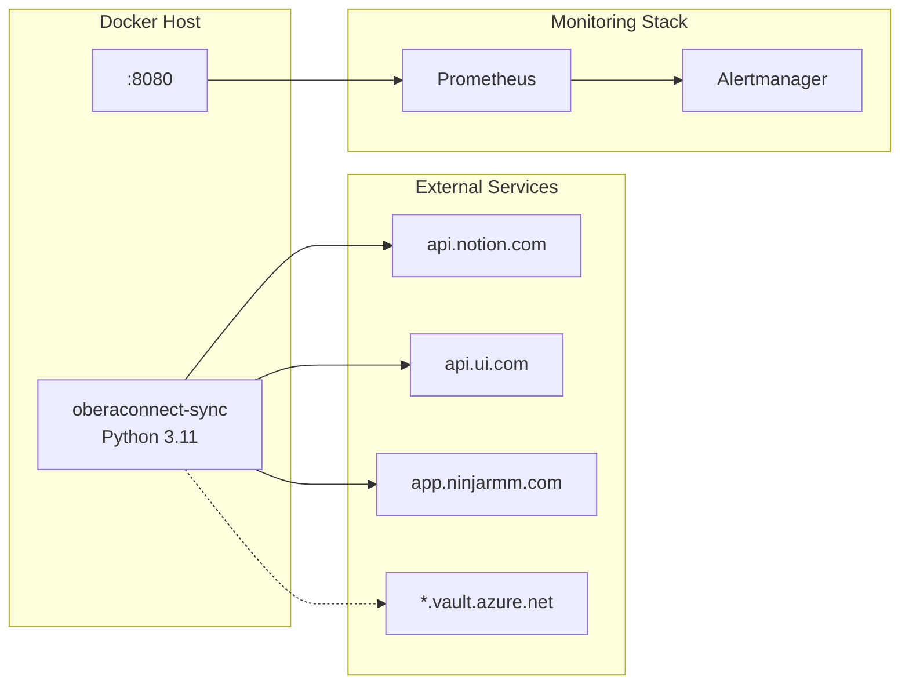
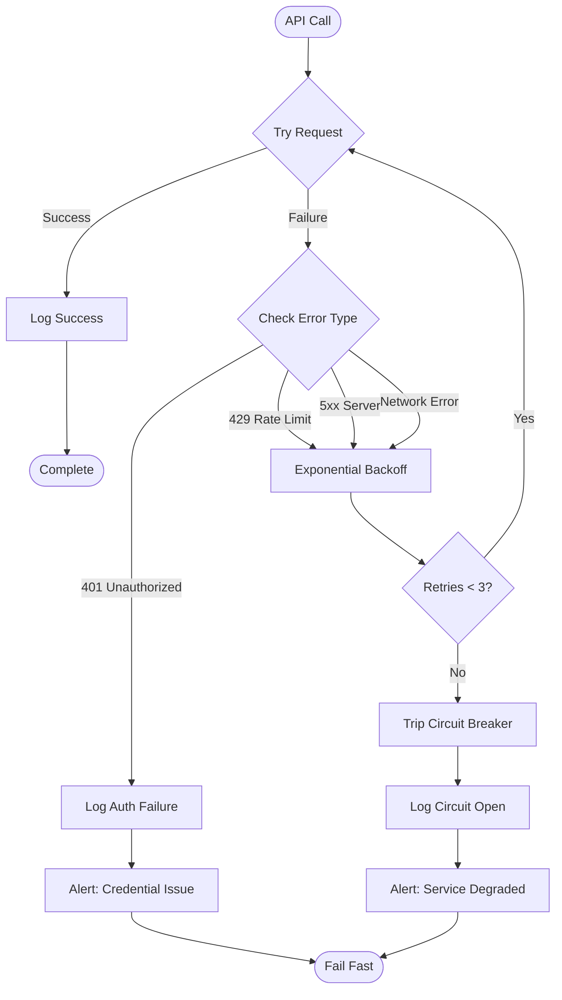
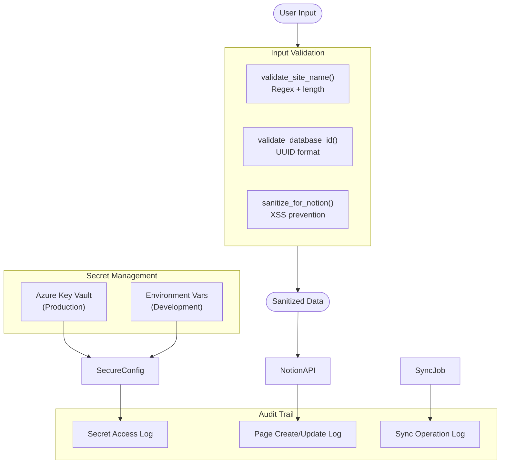

# OberaConnect Notion Dashboards - Architecture

## System Overview

## Component Details

### Security Layer

| Component | Purpose | Technology |
|-----------|---------|------------|
| Azure Key Vault | Production secret storage | Azure SDK |
| Environment Variables | Development/fallback | OS native |
| Audit Logging | Compliance trail | JSON structured logs |

### Sync Service Components

| Component | Responsibility | Key Features |
|-----------|---------------|--------------|
| `secure_config.py` | Credential management | Key Vault priority, env fallback, secret stripping |
| `resilience.py` | Fault tolerance | Retry (3x exponential), circuit breaker (5 failures), rate limiting |
| `structured_logging.py` | Observability | JSON format, correlation IDs, operation timing |
| `notion_client_wrapper.py` | API abstraction | Retry wrapper, input validation, audit logging |
| `health_check.py` | Monitoring endpoints | Liveness, readiness, Prometheus metrics |

### Data Flow

## Deployment Architecture

## Error Handling Flow

## Security Architecture

## Metrics & Monitoring

| Metric | Type | Description |
|--------|------|-------------|
| `oberaconnect_healthy` | Gauge | Overall service health (0/1) |
| `oberaconnect_uptime_seconds` | Gauge | Service uptime |
| `oberaconnect_component_healthy` | Gauge | Per-component health |
| `oberaconnect_component_latency_ms` | Gauge | API response time |
| `oberaconnect_sync_total` | Counter | Total sync operations |
| `oberaconnect_sync_errors` | Counter | Failed sync operations |

## Capacity Planning

| Resource | Current | Limit | Headroom |
|----------|---------|-------|----------|
| UniFi Sites | 98 | 500 | 5x |
| NinjaOne Devices | 323 | 1000 | 3x |
| Notion Pages | ~500 | 10,000 | 20x |
| API Rate (Notion) | 3/sec | 3/sec | At limit |
| Sync Frequency | 15 min | 5 min | 3x |

## Failure Domains

| Domain | Impact | Mitigation |
|--------|--------|------------|
| Notion API down | Dashboards stale | Circuit breaker, retry on recovery |
| UniFi API down | No site updates | Continue NinjaOne sync, alert |
| NinjaOne API down | No device/alert updates | Continue UniFi sync, alert |
| Key Vault down | Cannot start | Fallback to env vars |
| Network partition | All syncs fail | Health check degrades, alert |
