# OberaConnect Platform Architecture

**Last Updated:** October 9, 2025  
**Version:** 2.0  
**Total Tables:** 55+  
**Total Pages:** 64+  
**Total Edge Functions:** 17

## 🆕 Recent Updates (October 9, 2025)

### New Features
- **Products Admin**: Full product catalog management system
- **Keeper Security**: Password management app integration
- **Customer Subscriptions**: Product subscription tracking

### Documentation Updates
- Platform Feature Index created
- Component Library documented
- API Reference updated with new endpoints

---

## 🏛️ System Overview

OberaConnect is a multi-tenant SaaS platform built on a modular, clause-aware architecture that separates concerns across customer management, department operations, integrations, and AI capabilities.

### Complete System Architecture

```mermaid
graph TB
    subgraph "Frontend Layer (React + Vite)"
        Landing[Landing Page]
        Portal[Employee Portal]
        
        subgraph "Department Dashboards"
            ExecDash[Executive Dashboard]
            ITDash[IT Dashboard]
            HRDash[HR Dashboard]
            SalesDash[Sales Dashboard]
            FinDash[Finance Dashboard]
            OpsDash[Operations Dashboard]
            SOCDash[SOC Dashboard]
            CompDash[Compliance Dashboard]
        end
        
        subgraph "Admin & Tools"
            AdminDash[Admin Dashboard]
            AppAdmin[Applications Admin]
            WorkflowUI[Workflow Builder UI]
            WorkflowDetail[Workflow Execution Detail]
            KnowledgeUI[Knowledge Base UI]
            IntegUI[Integrations UI]
            TestValidation[System Validation Dashboard]
            TestComprehensive[Comprehensive Test Dashboard]
        end
        
        subgraph "AI Features"
            AIAssist[Department AI Assistant]
            IntAssist[Intelligent Assistant]
            MCPGen[MCP Generator UI]
        end
    end
    
    subgraph "Edge Functions Layer (Lovable Cloud)"
        DeptAssist[department-assistant]
        MCPServer[mcp-server]
        WorkflowExec[workflow-executor]
        WorkflowHook[workflow-webhook]
        RevioData[revio-data]
        GraphAPI[graph-api]
        SharePointSync[sharepoint-sync]
        KnowProc[knowledge-processor]
        IntellAssist[intelligent-assistant]
        AIMCPGen[ai-mcp-generator]
        WorkflowInsights[workflow-insights]
        CIPPSync[cipp-sync]
    end
    
    subgraph "Lovable Cloud Backend"
        Auth[Supabase Auth<br/>Email + OAuth]
        
        subgraph "Core Tables"
            Users[user_profiles]
            Customers[customers]
            Roles[roles + user_roles]
            Apps[applications]
        end
        
        subgraph "Integration Data"
            Integrations[integrations]
            IntegCreds[integration_credentials]
            OnboardData[client_onboardings]
        end
        
        subgraph "Workflow System"
            Workflows[workflows]
            WorkflowSteps[workflow_steps]
            WorkflowExecs[workflow_executions]
            WorkflowTriggers[workflow_triggers]
        end
        
        subgraph "AI & Knowledge"
            AIInteract[ai_interactions]
            KnowArticles[knowledge_articles]
            KnowFiles[knowledge_files]
            MLInsights[ml_insights]
        end
        
        subgraph "MCP System"
            MCPServers[mcp_servers]
            MCPTools[mcp_tools]
            MCPLogs[mcp_execution_logs]
        end
        
        subgraph "Compliance & Audit"
            CompFrameworks[compliance_frameworks]
            CompControls[compliance_controls]
            CompReports[compliance_reports]
            AuditLogs[audit_logs]
            PrivAccess[Privileged Access Audit]
        end
        
        RLS[Row Level Security<br/>Policies]
    end
    
    subgraph "External Systems"
        M365[Microsoft 365<br/>Calendar/Email/Teams]
        SharePoint[SharePoint<br/>Documents]
        Revio[Revio Billing<br/>Revenue Data]
        OneBill[OneBill<br/>Current System]
        NinjaOne[NinjaOne<br/>RMM/PSA]
        CIPP[CIPP<br/>M365 Tenant Management]
        LovableAI[Lovable AI<br/>Gemini/GPT Models]
    end
    
    %% Frontend to Edge Functions
    Portal --> DeptAssist
    AIAssist --> DeptAssist
    IntAssist --> IntellAssist
    WorkflowUI --> WorkflowExec
    WorkflowUI --> WorkflowHook
    SalesDash --> RevioData
    ITDash --> GraphAPI
    IntegUI --> SharePointSync
    KnowledgeUI --> KnowProc
    MCPGen --> AIMCPGen
    ExecDash --> WorkflowInsights
    
    %% Edge Functions to Database
    DeptAssist --> AIInteract
    DeptAssist --> KnowArticles
    IntellAssist --> AIInteract
    WorkflowExec --> WorkflowExecs
    WorkflowExec --> Workflows
    WorkflowHook --> WorkflowTriggers
    KnowProc --> KnowArticles
    KnowProc --> KnowFiles
    AIMCPGen --> MCPServers
    AIMCPGen --> MCPTools
    MCPServer --> MCPLogs
    WorkflowInsights --> WorkflowExecs
    
    %% Edge Functions to External Systems
    GraphAPI --> M365
    SharePointSync --> SharePoint
    RevioData --> Revio
    CIPPSync --> CIPP
    
    %% AI Integration
    DeptAssist --> LovableAI
    IntellAssist --> LovableAI
    KnowProc --> LovableAI
    AIMCPGen --> LovableAI
    
    %% Authentication Flow
    Landing --> Auth
    Portal --> Auth
    Auth --> Users
    Auth --> Roles
    RLS --> Auth
    
    %% Database Relationships
    Users --> Customers
    Roles --> Users
    Apps --> Roles
    Integrations --> Customers
    IntegCreds --> Integrations
    OnboardData --> Customers
    Workflows --> Customers
    WorkflowSteps --> Workflows
    MCPServers --> Customers
    MCPTools --> MCPServers
    KnowArticles --> Customers
    CompFrameworks --> CompControls
    CompReports --> Customers
    AuditLogs --> Users
    
    %% RLS Protection
    RLS -.->|Protects| Users
    RLS -.->|Protects| Customers
    RLS -.->|Protects| Workflows
    RLS -.->|Protects| KnowArticles
    RLS -.->|Protects| AIInteract
    
    style Landing fill:#8b5cf6,stroke:#7c3aed,color:#fff
    style Portal fill:#8b5cf6,stroke:#7c3aed,color:#fff
    style Auth fill:#10b981,stroke:#059669,color:#fff
    style RLS fill:#ef4444,stroke:#dc2626,color:#fff
    style LovableAI fill:#f59e0b,stroke:#d97706,color:#fff
    style M365 fill:#0078d4,stroke:#106ebe,color:#fff
    style Revio fill:#3b82f6,stroke:#2563eb,color:#fff
```



**Architecture Layers**:

1. **Frontend Layer (Purple)**: 8 department-specific dashboards, employee portal, admin tools, AI features, and CIPP management portal built in React with Vite
2. **Edge Functions Layer**: 12 serverless functions handling AI assistants, workflows, integrations, CIPP tenant management, and external API connections
3. **Backend Layer (Green/Red)**: Lovable Cloud (Supabase) with 55+ tables organized into core user data, workflows, AI/knowledge, MCP tools, compliance tracking, CIPP tenant management, and integrations - all protected by Row Level Security
4. **External Systems**: Microsoft 365, SharePoint, Revio billing, CIPP tenant management, NinjaOne RMM, and Lovable AI for LLM capabilities

All data flows through authentication and RLS policies ensure users only access their organization's data based on their role and department.

## 🎨 Architectural Principles

### 1. Database-Centric Hub Architecture
The platform follows a **hub-and-spoke model** where:
- **Central Hub**: Lovable Cloud (Supabase) database with the `customers` table as root entity
- **Authentication Layer**: All access flows through auth + Row Level Security
- **Feature Spokes**: Department dashboards, workflows, compliance, integrations, AI assistants
- **Data Flow**: All features read/write through the central database
- **AI Enhancement**: AI tools augment features but aren't required for core operations

### 2. Modular Design
Each subsystem is independently testable, replaceable, and documented:
- **Authentication Module**: User signup, login, session management
- **Customization Module**: Per-customer branding and feature toggles
- **Dashboard Module**: Department-specific views and data (8 dashboards + Sales Portal)
- **Integration Module**: External system connections
- **AI Module**: Department assistants and MCP server integration (enhancement layer)
- **Workflow Module**: Universal automation engine
- **Compliance Module**: Framework tracking and audit logging
  - **Scorecard Architecture**: Compliance scores are calculated by comparing framework requirements (from `compliance_frameworks` and `compliance_controls` tables) against actual compliance activities logged in `audit_logs`
  - **Data Flow**: 
    1. Load frameworks to define required compliance controls
    2. Query audit logs to retrieve historical compliance actions (tagged with `compliance_tags`)
    3. Calculate score by comparing completed actions vs. required controls
    4. Evidence uploads create new audit log entries, feeding back into next score calculation
  - **Tables**: `compliance_frameworks`, `compliance_controls`, `compliance_evidence`, `compliance_reports`, `audit_logs`

### 3. Data Isolation
- **Row Level Security (RLS)**: All tables enforce customer/user isolation
- **Department-Based Access**: Users see only their department's data
- **Customer Customization**: UI adapts per customer without code changes
- **Multi-Tenant Security**: Critical vulnerabilities patched (Oct 5, 2025)

### 4. Strategic Ownership
Design decisions remain with OberaConnect leadership:
- Schema structure (customer → profiles → customizations)
- Department role definitions
- Integration mapping logic
- AI assistant behavior
- Workflow orchestration patterns

## 🗄️ Database Architecture

### Schema Overview

```
┌─────────────────┐
│   customers     │ (root entity)
├─────────────────┤
│ id              │
│ company_name    │
│ plan            │
│ status          │
└────────┬────────┘
         │
         ├──────────────────┬──────────────────┐
         │                  │                  │
┌────────▼────────┐  ┌──────▼──────────┐  ┌──▼──────────────────┐
│ user_profiles   │  │ customer_       │  │ integrations        │
│                 │  │ customizations  │  │                     │
├─────────────────┤  ├─────────────────┤  ├─────────────────────┤
│ user_id         │  │ customer_id     │  │ customer_id         │
│ customer_id     │  │ company_logo    │  │ system_name         │
│ full_name       │  │ primary_color   │  │ integration_type    │
│ department      │  │ secondary_color │  │ status              │
│ role            │  │ accent_color    │  │ auth_method         │
└─────────────────┘  │ enabled_integ.. │  └─────────────────────┘
                     │ enabled_feat... │
                     │ default_dash... │
                     │ dashboard_lay.. │
                     │ custom_settings │
                     └─────────────────┘
```

### Key Tables

#### `customers`
Root entity representing client organizations.
- **Primary Key**: `id` (UUID)
- **Fields**: company_name, contact_email, plan (starter/professional/enterprise), status
- **RLS Policy**: Admin-only access for management

#### `user_profiles`
User accounts linked to customers with department roles.
- **Primary Key**: `id` (UUID)
- **Foreign Keys**: `user_id` → auth.users, `customer_id` → customers
- **Department Types**: admin, compliance, it, operations, hr, finance, sales, executive
- **RLS Policy**: Users can only view their own profile

#### `customer_customizations`
Per-customer UI and feature configuration.
- **Primary Key**: `id` (UUID)
- **Foreign Key**: `customer_id` → customers
- **Branding**: company_logo_url, primary_color, secondary_color, accent_color
- **Features**: enabled_integrations[], enabled_features[]
- **Layout**: default_dashboard, dashboard_layout (JSONB)
- **RLS Policy**: Users can read their customer's customization

#### `integrations`
External system connection registry.
- **Primary Key**: `id` (UUID)
- **Foreign Key**: `customer_id` → customers (optional, NULL for system-wide)
- **Types**: Billing, Cloud, Security, RMM, Compliance
- **RLS Policy**: Customer-scoped or public

#### `mcp_servers`
Model Context Protocol server registry for AI capabilities.
- **Primary Key**: `id` (UUID)
- **Fields**: name, url, description, capabilities[], status
- **RLS Policy**: Public read access

#### `workflows`
Cross-system workflow definitions and configurations.
- **Primary Key**: `id` (UUID)
- **Foreign Key**: `customer_id` → customers
- **Fields**: workflow_name, description, steps (JSONB), systems_involved[], is_active, workflow_type, version, tags[]
- **RLS Policy**: Admin-only access for management

#### `workflow_executions`
Historical record of workflow runs with execution logs.
- **Primary Key**: `id` (UUID)
- **Foreign Keys**: `workflow_id` → workflows, `customer_id` → customers
- **Fields**: triggered_by, trigger_data (JSONB), status, started_at, completed_at, error_message, execution_log (JSONB)
- **RLS Policy**: Admin view, system insert/update

#### `workflow_triggers`
Webhook, scheduled, and event-based trigger configurations.
- **Primary Key**: `id` (UUID)
- **Foreign Keys**: `workflow_id` → workflows, `customer_id` → customers
- **Fields**: trigger_type, trigger_config (JSONB), webhook_url, webhook_secret, is_enabled, last_triggered_at
- **RLS Policy**: Admin-only management

#### `workflow_conditions`
Conditional branching logic for workflows.
- **Primary Key**: `id` (UUID)
- **Foreign Key**: `workflow_id` → workflows
- **Fields**: step_id, condition_type, condition_expression (JSONB), true_path (JSONB), false_path (JSONB)
- **RLS Policy**: Admin-only management

#### `audit_logs`
Comprehensive audit trail for privileged access and system actions.
- **Primary Key**: `id` (UUID)
- **Foreign Keys**: `user_id` → auth.users, `customer_id` → customers
- **Fields**: action_type, system_name, action_details (JSONB), compliance_tags[], timestamp, ip_address, user_agent
- **Purpose**: Track all privileged access to RMM systems (NinjaOne, etc.), compliance actions, and security-critical operations
- **RLS Policy**: Users can view their customer's audit logs based on role permissions
- **Use Cases**: 
  - Privileged access tracking (who accessed which RMM system and when)
  - Compliance reporting (SOC2, HIPAA audit requirements)
  - Security incident investigation
  - Cross-platform activity correlation

## 🧩 Frontend Architecture

### Component Hierarchy

```
App.tsx (Root)
├── Navigation (Global)
├── Routes
│   ├── Index (Landing)
│   │   ├── Hero
│   │   ├── Features
│   │   ├── Integrations
│   │   ├── Testimonials
│   │   ├── Pricing
│   │   └── Footer
│   │
│   ├── Auth (Login/Signup)
│   │
│   ├── DemoSelector (Demo Mode Entry)
│   │
│   ├── IntegrationsPage (Integration Details)
│   │
│   ├── AdminDashboard
│   │   ├── Quick Access Menu Bar
│   │   │   ├── MCP Tools Dropdown (Server Status, Logs, Configure, AI Generator)
│   │   │   ├── Testing & Validation Dropdown (System Validation, Data & Security)
│   │   │   └── Admin Buttons (Applications, CMDB, Change Management)
│   │   ├── Dynamic Content Card (conditional, based on selected view)
│   │   │   ├── MCPServerStatus
│   │   │   ├── MCPExecutionLogs
│   │   │   ├── MCPServerConfig
│   │   │   └── AIMCPGenerator
│   │   └── Customer Management Table
│   │
│   └── [Department]Dashboard
│       ├── Stats Cards
│       ├── Department-Specific Widgets
│       └── DepartmentAIAssistant
│
└── Toaster, Sonner (Notifications)
```

### State Management

#### TanStack Query (React Query)
- Async state management for backend data
- Automatic caching and revalidation
- Query client configured in App.tsx

#### Custom Hooks
- **`useCustomerCustomization`**: Fetches and applies customer-specific UI settings
  - Loads from `customer_customizations` table
  - Applies CSS variables for theming
  - Returns: `{ customization, isLoading }`
  
- **`useDemoMode`**: Detects preview/demo environment
  - Returns: `{ isDemoMode: boolean }`

- **`useAuditLog`**: Centralized audit logging for privileged access and compliance
  - Automatically logs user, customer, and timestamp information
  - Provides `logAction()` for general audit events
  - Provides `logPrivilegedAccess()` for RMM/privileged system access
  - Tags logs with compliance categories (e.g., 'privileged_access', 'rmm', 'ninjaone')
  - Returns: `{ logAction, logPrivilegedAccess }`

### Routing Strategy

**React Router v6** with role-based access:
- `/` → Landing page (public)
- `/auth` → Authentication (public)
- `/demo` → Demo mode selector
- `/integrations` → Integration details (public)
- `/admin` → Admin dashboard (admin role)
- `/dashboard/:department` → Department dashboards (role-based)
- `/privileged-access-audit` → Privileged access audit logs (admin/compliance role)

Each dashboard component:
1. Checks authentication state
2. Verifies department access
3. Fetches department-specific data
4. Renders with customer customization

## 🎨 Design System

### Token-Based Styling

All colors defined as HSL semantic tokens in `src/index.css`:
```css
:root {
  --primary: [HSL];
  --secondary: [HSL];
  --accent: [HSL];
  --background: [HSL];
  --foreground: [HSL];
  /* ... */
}
```

### Customization Flow
1. User signs up → `customer_customizations` record created
2. `useCustomerCustomization` hook loads on dashboard mount
3. Hook applies CSS variables: `document.documentElement.style.setProperty('--primary', value)`
4. All components automatically reflect custom colors

### Component Library
- **Base**: shadcn/ui + Radix UI primitives
- **Custom**: Feature-specific components in `/components`
- **Styling**: Tailwind CSS with design tokens (no hardcoded colors)

## 🔌 Integration Architecture

### Integration Types

1. **Billing & Revenue**: Onebill, rev.io
2. **Cloud & Identity**: Azure, Lighthouse, CIPP
3. **Network Security**: SonicWall, UniFi, MikroTik
4. **Security & Access**: Keeper Security
5. **RMM & Infrastructure**: NinjaOne
6. **Cybersecurity**: Threatdown, OpenText

### Integration Registry Pattern
```typescript
interface Integration {
  id: string;
  customer_id?: string;  // NULL = system-wide
  system_name: string;
  integration_type: string;
  status: 'active' | 'inactive' | 'error';
  config: Record<string, any>;  // JSONB
  last_sync: timestamp;
}
```

### Integration Display
- **Landing Page**: High-level overview with logos
- **Integrations Page**: Detailed info (auth methods, permissions, setup)
- **Dashboard**: Live status indicators

### CIPP Tenant Management

**CIPP (CyberDrain Improved Partner Portal)** provides centralized Microsoft 365 tenant management:

**Frontend**: `src/pages/CIPPDashboard.tsx` - Tenant overview and health monitoring

**Backend**: `supabase/functions/cipp-sync/index.ts` - CIPP API integration

**Database Tables**:
- `cipp_tenants` - Microsoft 365 tenant registry with sync status
- `cipp_security_baselines` - Automated security configurations
- `cipp_policies` - Conditional Access, Intune, and compliance policies
- `cipp_tenant_health` - Health scores, security metrics, and alerts
- `cipp_audit_logs` - CIPP action audit trail

**Key Capabilities**:
- **Tenant Sync**: Import and manage multiple Microsoft 365 tenants
- **Security Baselines**: Apply standardized security configurations across tenants
- **Policy Management**: Centralized Conditional Access and Intune policies
- **Health Monitoring**: Real-time security and compliance scoring
- **Bulk Operations**: Apply changes across multiple tenants simultaneously

**Workflow**:
1. Admin navigates to `/cipp` dashboard
2. Clicks "Sync Tenants" to import from CIPP instance
3. Views tenant health scores and security metrics
4. Creates and applies security baselines
5. Manages policies across tenant portfolio

**RLS Policies**: Admins can manage all CIPP resources, users can view their organization's tenants

## 🤖 AI Architecture

### Department AI Assistants

Each department has a specialized AI assistant:
- **Component**: `DepartmentAIAssistant.tsx`
- **Backend**: `supabase/functions/department-assistant/index.ts`
- **Models**: Lovable AI (Gemini, GPT variants)

### Assistant Behavior
1. User sends message from department dashboard
2. Frontend calls edge function with department context
3. Edge function routes to appropriate AI model
4. Response streamed back to UI
5. Context includes: department type, customer data, recent activity

### MCP Server Integration

**Model Context Protocol** for advanced AI capabilities:
- **Registry**: `mcp_servers` table tracks available servers
- **Status Component**: `MCPServerStatus.tsx` shows health
- **Edge Function**: `supabase/functions/mcp-server/index.ts`
- **Capabilities**: Tool execution, structured outputs, multi-step reasoning

### Universal Workflow Engine

**Advanced workflow automation with visual builder**:
- **Visual Builder**: `WorkflowBuilder.tsx` - drag-and-drop step configuration
- **Trigger Management**: `WorkflowTriggerManager.tsx` - webhook, schedule, event-based triggers
- **Execution History**: `WorkflowExecutionHistory.tsx` - real-time status and logs
- **Edge Functions**:
  - `workflow-executor`: Executes workflows with conditional logic, API calls, data transforms
  - `workflow-webhook`: Secure webhook endpoint with signature verification
- **Features**:
  - Multi-step workflows with branching logic
  - Webhook triggers with auto-generated URLs
  - Scheduled execution (cron)
  - Conditional steps (if/switch/loop)
  - API call orchestration
  - Database operations
  - Real-time execution logs
  - Error handling and retry logic

## 🔐 Security Architecture

### Authentication Flow
```
User → Supabase Auth → Session Token → RLS Policies → Data Access
```

### Row Level Security (RLS)
Every table has policies enforcing:
- **Customer Isolation**: Users see only their customer's data
- **Role-Based Access**: Department-specific data filtering
- **Admin Override**: Admins can view all customers (for management)

### Example Policy (user_profiles)
```sql
CREATE POLICY "Users can view their own profile"
ON user_profiles FOR SELECT
USING (auth.uid() = user_id);
```

## 🚀 Deployment Architecture

### Lovable Cloud Platform
- **Frontend**: Deployed via Lovable (CDN + edge caching)
- **Backend**: Supabase (Postgres + Edge Functions)
- **Static Assets**: Bundled with Vite, served from CDN

### Environment Configuration
- `.env` file (auto-managed by Lovable Cloud)
- `VITE_SUPABASE_URL`: Backend API endpoint
- `VITE_SUPABASE_PUBLISHABLE_KEY`: Anonymous access key
- `VITE_SUPABASE_PROJECT_ID`: Project identifier

### Edge Functions
- **Runtime**: Deno on Supabase Edge
- **Auto-deployment**: Changes pushed automatically
- **Secrets**: Managed via Lovable Cloud secrets management

**Available Edge Functions**:
1. **department-assistant**: Department-specific AI chat with context awareness
2. **mcp-server**: Model Context Protocol tool execution
3. **workflow-executor**: Orchestrates multi-step workflow execution with conditional logic
4. **workflow-webhook**: Receives webhook triggers and initiates workflow runs
5. **revio-data**: Customer billing and revenue data aggregation (placeholder until live)
6. **graph-api**: Microsoft 365 Graph API integration
7. **sharepoint-sync**: SharePoint document synchronization
8. **knowledge-processor**: AI-powered knowledge base processing
9. **intelligent-assistant**: Cross-department AI assistant
10. **ai-mcp-generator**: Automated MCP configuration
11. **workflow-insights**: Workflow analytics and optimization

## 📊 Data Flow Examples

### User Signup Flow
```
1. User submits signup form (Auth.tsx)
   ↓
2. Supabase Auth creates user in auth.users
   ↓
3. Trigger creates customer record
   ↓
4. Trigger creates user_profile record
   ↓
5. Trigger creates customer_customizations with defaults
   ↓
6. User redirected to department dashboard
   ↓
7. useCustomerCustomization loads and applies branding
```

### Dashboard Data Load Flow
```
1. User navigates to /dashboard/[department]
   ↓
2. Dashboard component checks authentication
   ↓
3. Verifies user's department matches route
   ↓
4. Fetches department-specific stats (RLS enforced)
   ↓
5. Renders with customer customization applied
   ↓
6. AI assistant ready for department-specific queries
```

## 🧪 Testing Strategy

### Component Testing
- Manual testing in preview environment
- Visual regression via screenshots
- Interaction testing for critical flows

### Database Testing
- Migration testing in development environment
- RLS policy validation
- Data integrity constraints

### Integration Testing
- API endpoint validation
- Edge function execution
- Authentication flow verification

## 🔄 Scalability Considerations

### Current Scale
- Multi-tenant (customers isolated by RLS)
- Department-based data partitioning
- Per-customer customization without code deployment

### Future Scale
- Horizontal: More customers → RLS handles isolation
- Vertical: More data per customer → Postgres indexing
- Geographic: Edge functions already distributed globally

## 📈 Performance Patterns

### Frontend
- Code splitting via React Router
- Lazy loading of dashboard components
- TanStack Query caching reduces API calls
- Design tokens prevent CSS bloat

### Backend
- Database indexes on foreign keys
- RLS policies use indexed columns
- Edge functions minimize cold starts
- JSONB fields for flexible schema evolution

## 🔍 Monitoring & Observability

### Available Tools
- Supabase Dashboard: Query performance, logs, RLS policy hits
- Console Logs: Frontend errors and debugging
- Network Requests: API call inspection
- Edge Function Logs: Backend execution traces

---

**Architecture Ownership**: This design is maintained by OberaConnect leadership. Developers implement within this framework to ensure strategic consistency and platform resilience.