# Dashboard Data Flow Diagrams

This document contains data flow diagrams for all dashboards in the platform.

## CIPP Dashboard

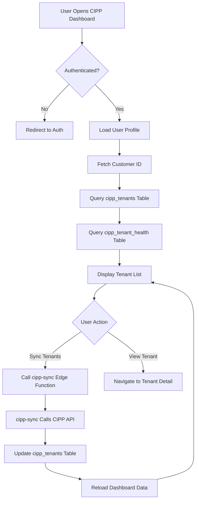

## CMDB Dashboard

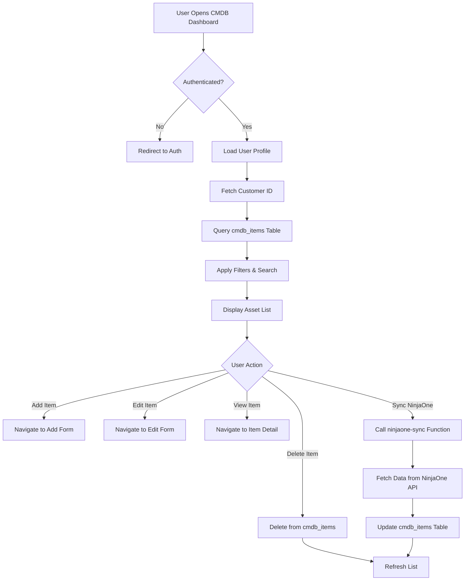

## Change Management Dashboard

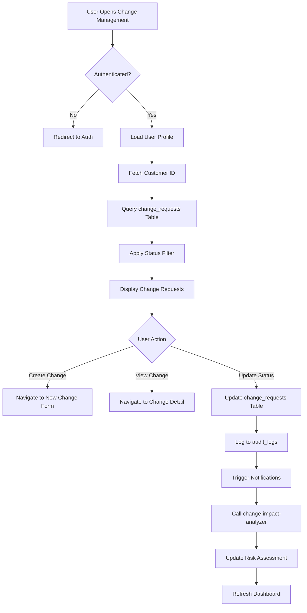

## Compliance Dashboard

### Scorecard Architecture
The compliance scorecard is calculated by comparing **framework requirements** (what controls need to be met) against **audit logs** (past compliance actions taken). The score measures actual compliance activities performed versus required framework controls.

**Data Flow:**
1. **Load Frameworks** - Defines required compliance controls and standards
2. **Load Audit Logs** - Shows historical compliance actions and activities
3. **Score Calculation** - Compares audit log entries (tagged with compliance activities) against framework's required controls to generate compliance percentage
4. **Evidence Upload** - Creates new audit log entries that feed back into the next score calculation

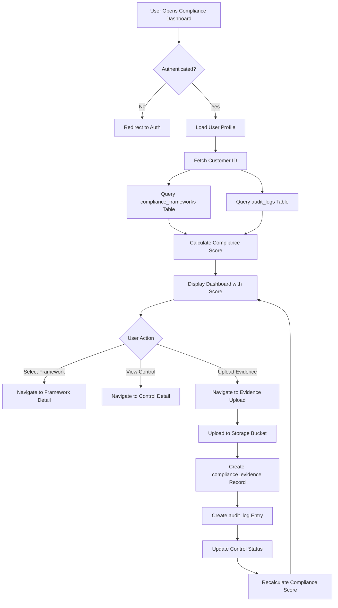

## Admin Dashboard

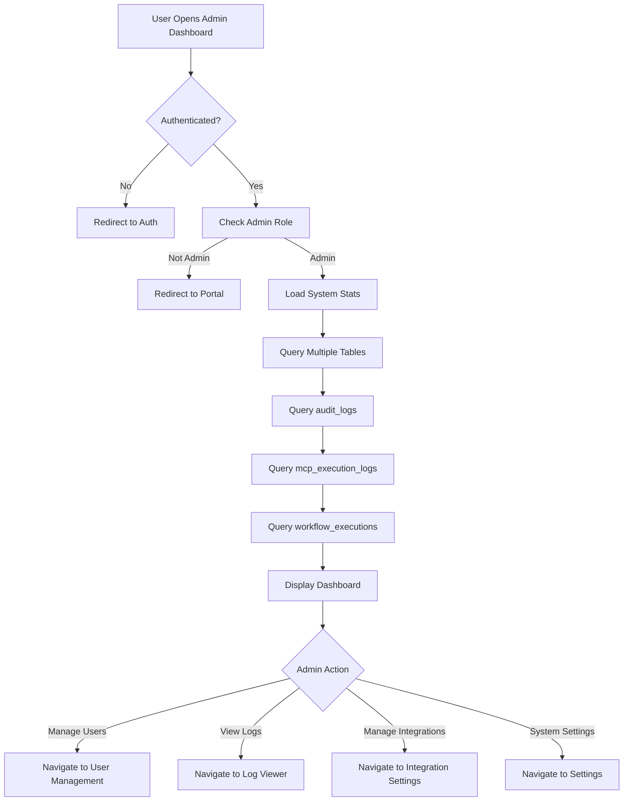

## IT Dashboard

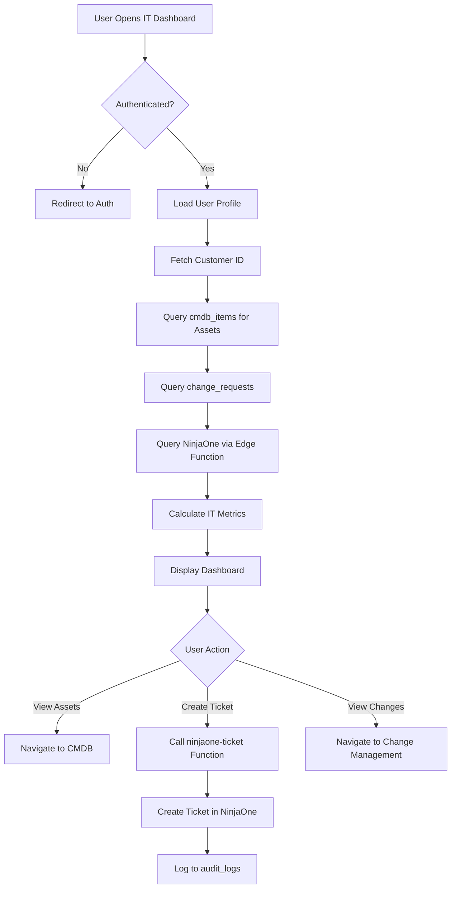

## Executive Dashboard

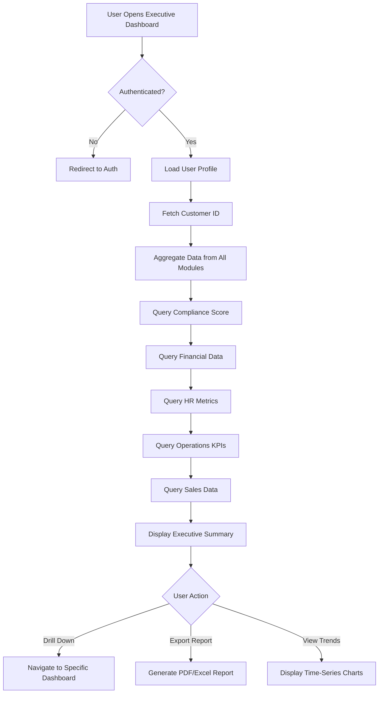

## Sales Dashboard

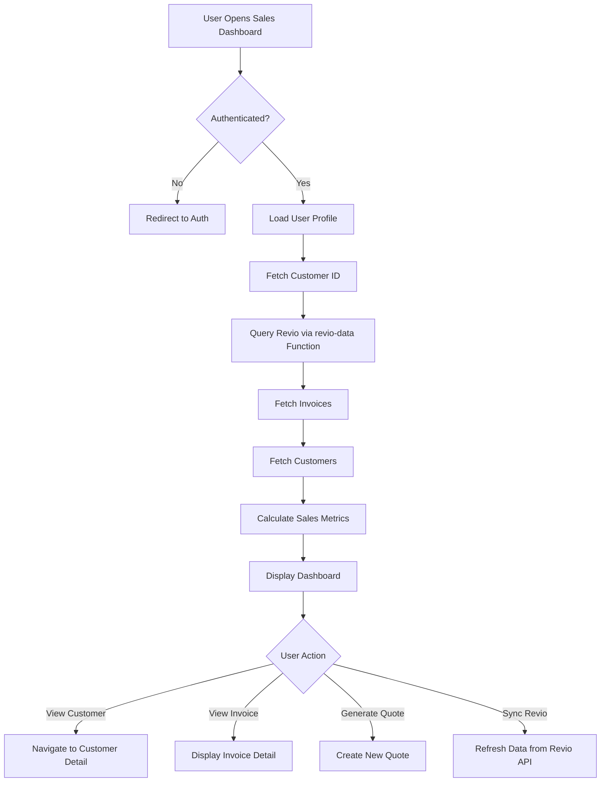

## HR Dashboard

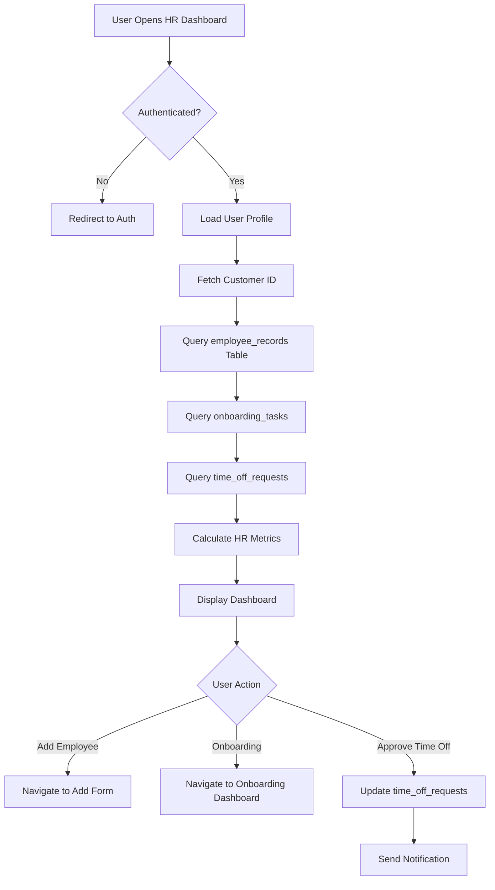

## Finance Dashboard

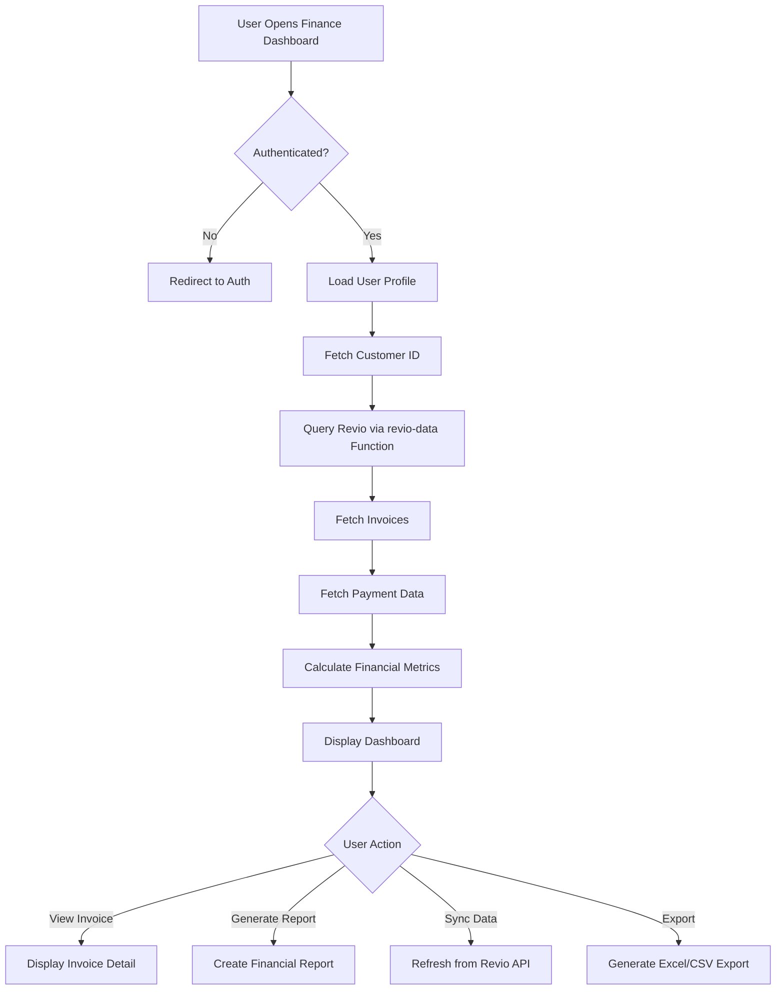

## Operations Dashboard

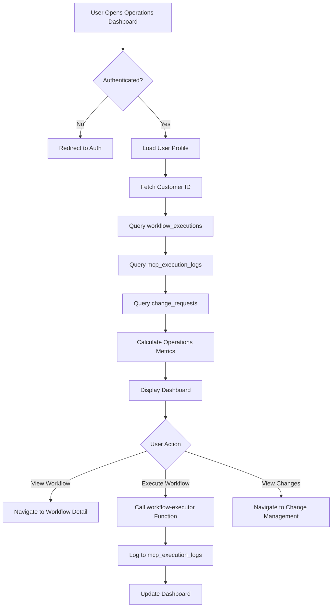

## SOC Dashboard

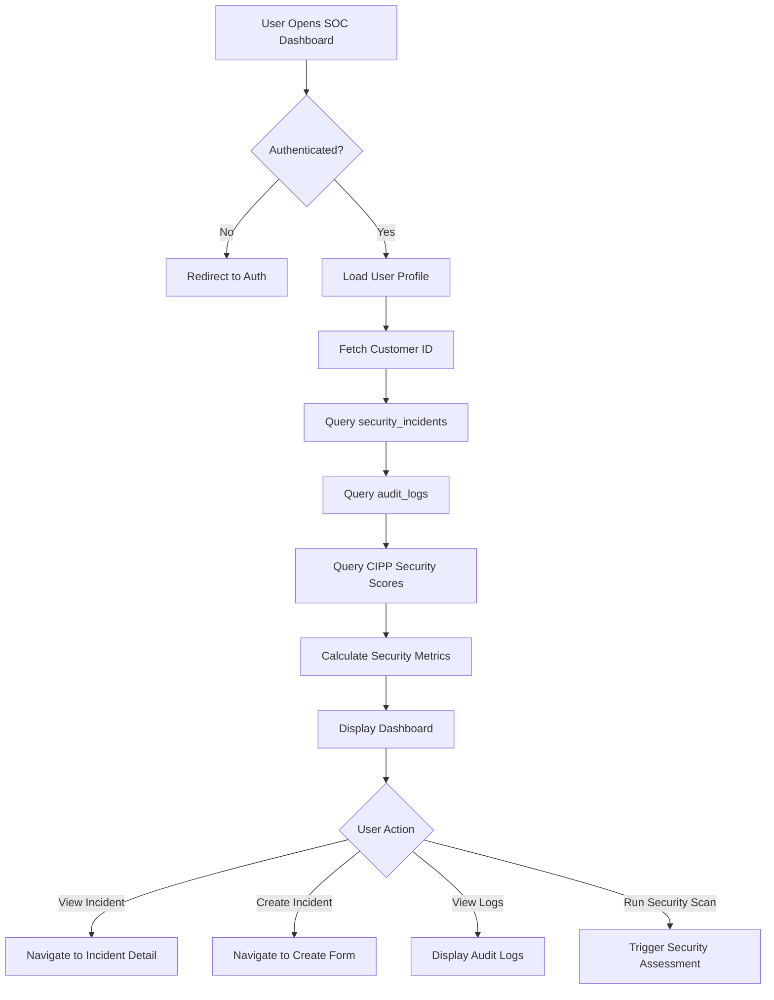

## Workflow Automation Dashboard

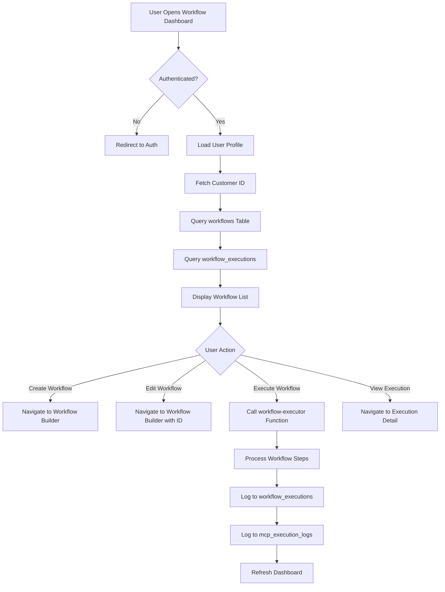

## MCP Server Dashboard

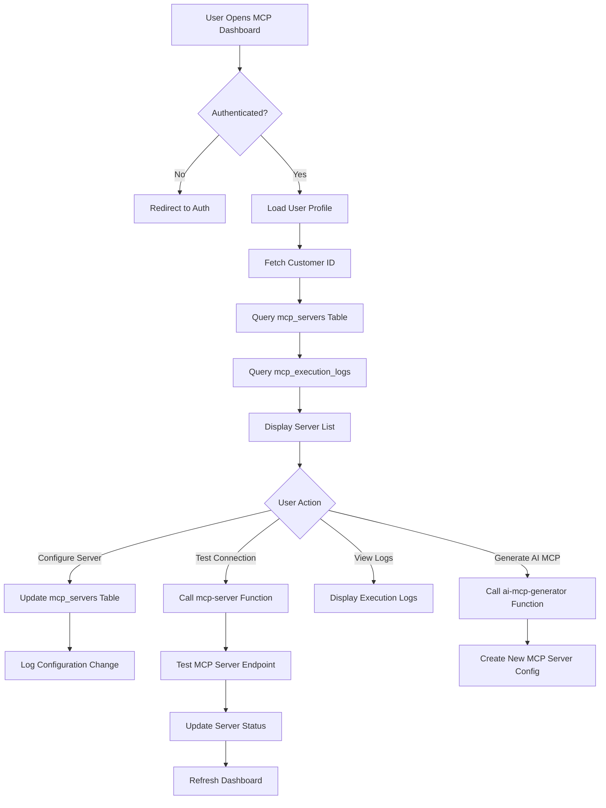

## Onboarding Dashboard

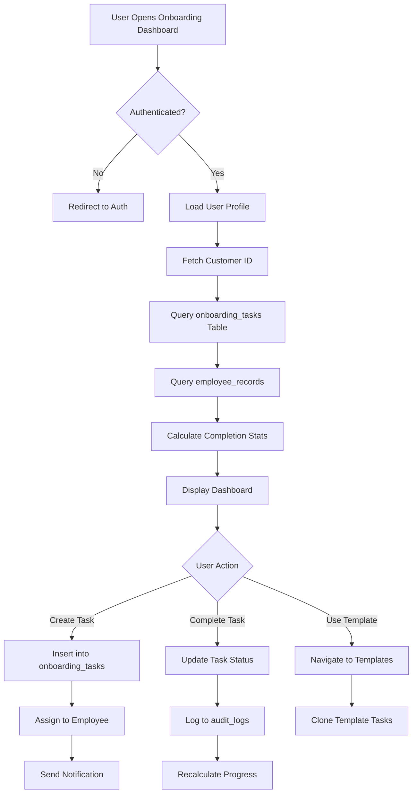
