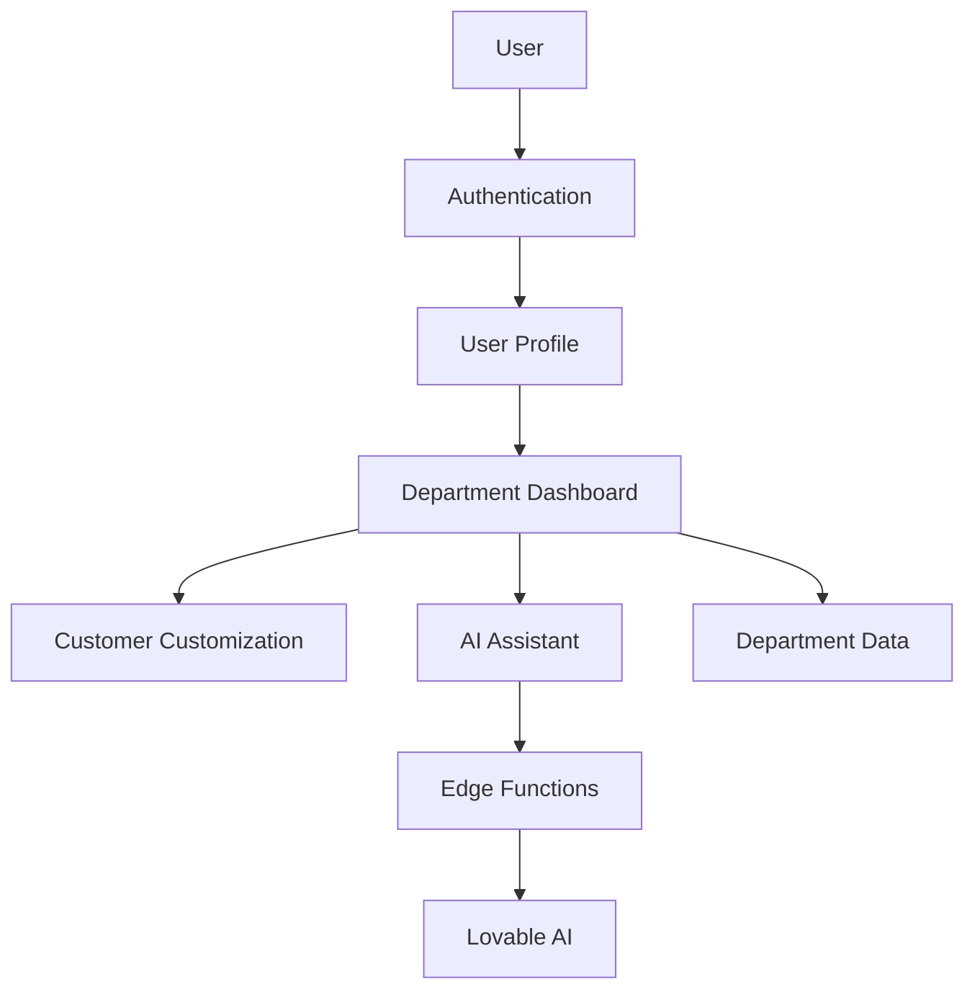

# Developer Handoff Protocol

## 🎯 Purpose

This document outlines the **knowledge transfer process** when a developer transitions off the OberaConnect platform project. Following this protocol ensures continuity, minimizes disruption, and converts individual knowledge into team assets.

## 📋 Handoff Checklist

### Before Departure (2-4 Weeks Notice)

- [ ] **Schedule Handoff Sessions** (minimum 3 sessions)
- [ ] **Record Architecture Walkthrough** (video)
- [ ] **Document Active Work** (in-progress features)
- [ ] **Export Technical Diagrams** (architecture, data flow)
- [ ] **Update All Documentation** (ensure accuracy)
- [ ] **Create Troubleshooting Guide** (known issues)
- [ ] **List External Contacts** (if any third-party integrations)
- [ ] **Transfer Code Ownership** (GitHub permissions)

---

## 🎥 Recording Requirements

### 1. Architecture Walkthrough (30-45 min)

**Topics to Cover**:
- System overview and design philosophy
- Database schema and relationships
- Key modules and their interactions
- Authentication and RLS policy overview
- Customer customization flow
- Department dashboard architecture
- Integration module organization
- AI assistant and MCP server integration

**Screen Recording Checklist**:
- [ ] Navigate through codebase structure
- [ ] Open key files and explain responsibilities
- [ ] Show database tables in backend UI
- [ ] Demonstrate RLS policies in action
- [ ] Walk through a typical user flow (signup → dashboard)

**Suggested Script**:
```
"I'm going to walk you through the OberaConnect platform architecture. 

First, let's look at the project structure [open src/]. The main entry point is App.tsx, which sets up routing for all our department dashboards...

Now let's look at authentication [open Auth.tsx]. When a user signs up, we create three records: a customer, a user profile, and a customization entry...

[Continue through each major module]"
```

### 2. Key Flows and Logic Decisions (20-30 min)

**Topics to Cover**:
- Why certain design decisions were made
- Tradeoffs considered (e.g., monorepo vs. separate services)
- Complex logic explanations (customization application, RLS policies)
- Performance optimizations implemented
- Security considerations
- Known limitations and workarounds

**Example Walkthrough**:
```
"Let me explain why we use the useCustomerCustomization hook. 

We wanted per-customer branding without deploying new code for each customer. So we store colors in the database and apply them as CSS variables at runtime.

The alternative was using Tailwind's JIT with dynamic classes, but that would require rebuilds. This approach is more flexible...

[Continue with other decisions]"
```

### 3. Common Issues and Solutions (15-20 min)

**Topics to Cover**:
- Most frequent bugs and their fixes
- Debugging techniques used
- Environment-specific issues (dev vs. production)
- Third-party integration quirks
- Performance bottlenecks and solutions

**Example Content**:
```
"Here are the issues I've encountered most often:

1. RLS policy denials: This usually means the user_profile wasn't created properly during signup. Check that the trigger is firing...

2. CSS variables not applying: This happens if customization loads after the component renders. Make sure to check isLoading...

[Continue with other issues]"
```

---

## 📄 Documentation Updates

### Required Document Updates

#### 1. README.md
- [ ] Verify all setup instructions are current
- [ ] Update technology stack versions
- [ ] Confirm deployment process is accurate

#### 2. ARCHITECTURE.md
- [ ] Document any schema changes made
- [ ] Update data flow diagrams
- [ ] Reflect new modules or components added
- [ ] Document new hooks (e.g., useAuditLog)
- [ ] Update routing table with new pages

#### 3. ONBOARDING.md
- [ ] Add any new learning resources discovered
- [ ] Update hands-on exercises if codebase changed
- [ ] Revise timeline if onboarding speed changed

#### 4. MODULE_STRUCTURE.md
- [ ] Document new modules created
- [ ] Update dependency graph if changed
- [ ] Add any new interaction flows

#### 5. API_REFERENCE.md
- [ ] Document new edge functions
- [ ] Add any new database tables or fields (e.g., audit_logs)
- [ ] Update query examples if patterns changed
- [ ] Document new hooks and their usage patterns

### Creating a Custom Handoff Document

If you've worked on specific features, create a dedicated document:

**Filename**: `HANDOFF_[YOUR_NAME]_[DATE].md`

**Template**:
```markdown
# Developer Handoff: [Your Name]

**Date**: [Departure Date]
**Duration on Project**: [Start Date] - [End Date]
**Primary Focus Areas**: [List main responsibilities]

## Active Work

### In Progress
- **Feature**: [Name]
- **Status**: [% complete]
- **Next Steps**: [What needs to be done]
- **Blockers**: [Any known issues]
- **Files**: [List key files]

### Recently Completed
- [Feature 1]: [Brief description, files changed]
- [Feature 2]: [Brief description, files changed]

## Key Decisions Made

### Decision 1: [Title]
- **Context**: [Why decision was needed]
- **Options Considered**: [List alternatives]
- **Choice**: [What was chosen]
- **Rationale**: [Why this was best]
- **Tradeoffs**: [What was sacrificed]

## Known Issues

### Issue 1: [Title]
- **Description**: [What happens]
- **Reproduction**: [Steps to reproduce]
- **Workaround**: [Temporary fix]
- **Root Cause**: [If known]
- **Suggested Fix**: [How to solve permanently]

## Unfinished Ideas

### Idea 1: [Title]
- **Purpose**: [What it would do]
- **Design Notes**: [How it could work]
- **Dependencies**: [What's needed first]
- **Priority**: [Low/Medium/High]

## Code Quality Notes

### Areas Needing Refactoring
- [File/Component]: [Why it needs work]

### Test Coverage Gaps
- [Module]: [What isn't tested]

### Documentation Debt
- [Feature]: [What needs better docs]

## External Resources

### Third-Party Integrations
- [Integration Name]: [Contact, docs link, credentials location]

### Learning Resources
- [Resource]: [Why it's useful, link]

## Contacts

### Team Members
- [Name]: [Role, expertise area, contact]

### External Contacts (if any)
- [Name]: [Company, role, why we contact them]

## Final Notes

[Any other advice, gotchas, or wisdom to share]
```

---

## 📊 Diagram Exports

### Required Diagrams

#### 1. Architecture Diagram
Visual representation of system components and their relationships.

**Tools**: Use Mermaid in a markdown file or export from Figma/Excalidraw.

**Example**:


#### 2. Data Flow Diagram
Show how data moves through the system for key flows.

**Example Flows**:
- User signup flow
- Dashboard load flow
- AI query flow
- Integration sync flow

#### 3. Database Schema Diagram
Visual representation of tables and relationships.

**Export from Backend UI**:
1. Navigate to backend (View Backend)
2. Go to Database → Schema Visualizer
3. Export as image or SQL

---

## 🔄 Active Work Transition

### For In-Progress Features

#### Document Current State

```markdown
## Feature: [Name]

**Branch**: feature/[name]
**Start Date**: [Date]
**Current Status**: [% complete]

### What's Done
- [Task 1]: [Description]
- [Task 2]: [Description]

### What's Left
- [Task 3]: [Description, estimated time]
- [Task 4]: [Description, estimated time]

### Key Files
- `src/components/NewComponent.tsx`: [What it does]
- `src/pages/NewPage.tsx`: [What it does]
- `supabase/functions/new-function/`: [What it does]

### Next Steps
1. [Step 1]
2. [Step 2]
3. [Step 3]

### Known Issues
- [Issue 1]: [Description, workaround]

### Testing Plan
- [ ] [Test case 1]
- [ ] [Test case 2]

### Dependencies
- Waiting on: [External dependency if any]
- Blocks: [What this blocks if any]
```

#### Code Handoff

1. **Push All Work**: Ensure all commits are pushed to GitHub
2. **Create Draft PR**: Open pull request even if incomplete
3. **Document in PR**: Add detailed description of progress
4. **Tag Successor**: Assign PR to next developer

---

## 🧠 Knowledge Transfer Sessions

### Session 1: Architecture & Design (1.5 hours)

**Agenda**:
- System overview (15 min)
- Database schema walkthrough (20 min)
- Module structure and dependencies (20 min)
- Customer customization flow (15 min)
- Q&A (20 min)

**Materials**:
- Architecture diagrams
- Database schema
- Live codebase walkthrough

### Session 2: Development Workflows (1 hour)

**Agenda**:
- Git workflow and branching (10 min)
- Local development setup (10 min)
- Testing strategies (10 min)
- Debugging techniques (10 min)
- Common issues and fixes (15 min)
- Q&A (5 min)

**Materials**:
- ONBOARDING.md guide
- Example bug fixes
- Debug logs

### Session 3: Specific Features & Edge Cases (1 hour)

**Agenda**:
- Department dashboards deep dive (15 min)
- AI assistant integration (15 min)
- Integration module (10 min)
- Known limitations and workarounds (10 min)
- Future roadmap context (5 min)
- Q&A (5 min)

**Materials**:
- Feature demos
- Code samples
- Roadmap notes

---

## 🔐 Access Transfer

### Accounts & Credentials

- [ ] **GitHub Access**: Verify successor has repo access
- [ ] **Lovable Account**: Confirm project access
- [ ] **Backend UI**: Ensure database access
- [ ] **Third-Party Services**: Transfer credentials (if any)
- [ ] **Documentation Access**: Share Google Docs, Notion, etc.

### Code Ownership

- [ ] Update CODEOWNERS file (if exists)
- [ ] Transfer open PRs to successor
- [ ] Hand over issue triage responsibilities

---

## ✅ Final Verification

Before your last day, verify:

- [ ] All documentation is up-to-date
- [ ] All code is pushed to GitHub
- [ ] Recordings are uploaded and accessible
- [ ] Diagrams are exported and saved
- [ ] Handoff document is complete
- [ ] Successor has access to all resources
- [ ] Knowledge transfer sessions completed
- [ ] Open work is documented and assigned

---

## 📞 Post-Departure Support

If available, provide:

**Contact Information**:
- Personal email: [For urgent questions]
- LinkedIn: [For professional network]

**Availability**:
- "I'm available for [X weeks/months] for occasional questions via email."
- "Best time to reach me: [Time/Days]"

**Boundaries**:
- "I'll respond within [X days] when possible."
- "For urgent issues, contact [team lead/manager]."

---

## 🎓 Lessons Learned

Optional but valuable: Share your experience working on the project.

```markdown
## Lessons Learned

### What Went Well
- [Success 1]: [Why it worked]
- [Success 2]: [Why it worked]

### What Could Be Improved
- [Challenge 1]: [How to address]
- [Challenge 2]: [How to address]

### Advice for Next Developer
- [Tip 1]
- [Tip 2]
- [Tip 3]

### Resources That Helped Me
- [Resource 1]: [Why it was useful]
- [Resource 2]: [Why it was useful]
```

---

## 📈 Success Metrics

A successful handoff means:

- ✅ **Successor can run the project locally** within 1 day
- ✅ **Successor understands architecture** within 1 week
- ✅ **Successor completes first feature** within 2 weeks
- ✅ **No critical knowledge gaps** discovered post-departure
- ✅ **All active work** is successfully transitioned

---

**Note**: This handoff protocol is designed to protect OberaConnect's investment and ensure the platform continues to thrive regardless of team changes. Your contribution to this process ensures organizational resilience and respects the work of future developers.