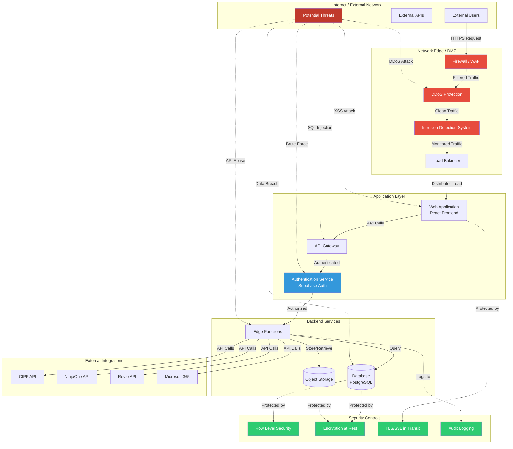

# Network Security Architecture Diagram

This document outlines the network edge, data packet flow over the internet, and potential vulnerabilities present in the system.

## Network Security Architecture

## Packet Flow Overview

### Inbound Traffic Flow
1. **External User Request** → Packet enters from internet
2. **Firewall/WAF** → First line of defense, filters malicious traffic
3. **DDoS Protection** → Mitigates volumetric attacks
4. **IDS** → Monitors for suspicious patterns
5. **Load Balancer** → Distributes traffic across application instances
6. **Web Application** → Serves React frontend
7. **API Gateway** → Routes API requests
8. **Authentication** → Validates user identity
9. **Edge Functions** → Processes business logic
10. **Database/Storage** → Persists data

### Outbound Traffic Flow
1. **Edge Functions** → Initiates external API calls
2. **External Integrations** → CIPP, NinjaOne, Revio, M365
3. **Response** → Data returned to application layer
4. **Client** → Data rendered in web application

## Identified Vulnerabilities

### 1. **Application Layer Vulnerabilities**

#### SQL Injection (High Risk)
- **Location**: API Gateway → Database queries
- **Attack Vector**: Malicious SQL in API parameters
- **Mitigation**: 
  - Use parameterized queries
  - Implement RLS policies
  - Input validation and sanitization

#### Cross-Site Scripting (XSS) (Medium Risk)
- **Location**: Web Application frontend
- **Attack Vector**: Injected scripts in user input
- **Mitigation**:
  - Content Security Policy (CSP)
  - Input sanitization
  - Output encoding

#### Cross-Site Request Forgery (CSRF) (Medium Risk)
- **Location**: Web Application forms
- **Attack Vector**: Unauthorized commands from authenticated users
- **Mitigation**:
  - CSRF tokens
  - SameSite cookie attributes
  - Origin header validation

### 2. **Authentication & Authorization Vulnerabilities**

#### Brute Force Attacks (High Risk)
- **Location**: Authentication Service
- **Attack Vector**: Automated password guessing
- **Mitigation**:
  - Rate limiting
  - Account lockout policies
  - Multi-factor authentication (MFA)

#### Session Hijacking (High Risk)
- **Location**: Auth tokens in transit
- **Attack Vector**: Token interception
- **Mitigation**:
  - HTTPOnly cookies
  - Secure cookie flags
  - Short-lived tokens

#### Privilege Escalation (High Risk)
- **Location**: Authorization checks
- **Attack Vector**: Bypassing role checks
- **Mitigation**:
  - Row Level Security (RLS)
  - Role-based access control (RBAC)
  - Audit logging

### 3. **Network Layer Vulnerabilities**

#### Distributed Denial of Service (DDoS) (High Risk)
- **Location**: Network Edge
- **Attack Vector**: Volumetric traffic flood
- **Mitigation**:
  - DDoS protection service
  - Rate limiting
  - Traffic filtering

#### Man-in-the-Middle (MITM) (Medium Risk)
- **Location**: Data in transit
- **Attack Vector**: Traffic interception
- **Mitigation**:
  - TLS/SSL encryption
  - Certificate pinning
  - HSTS headers

### 4. **API Vulnerabilities**

#### API Abuse (Medium Risk)
- **Location**: Edge Functions
- **Attack Vector**: Excessive API calls, resource exhaustion
- **Mitigation**:
  - Rate limiting per user/IP
  - API quotas
  - Request throttling

#### Insecure API Keys (High Risk)
- **Location**: External Integration credentials
- **Attack Vector**: Exposed API keys in code/logs
- **Mitigation**:
  - Secrets management system
  - Key rotation policies
  - Environment variables

#### Insufficient Logging (Medium Risk)
- **Location**: All layers
- **Attack Vector**: Undetected intrusions
- **Mitigation**:
  - Comprehensive audit logging
  - Real-time monitoring
  - SIEM integration

### 5. **Data Storage Vulnerabilities**

#### Data Breach (Critical Risk)
- **Location**: Database
- **Attack Vector**: Unauthorized data access
- **Mitigation**:
  - Encryption at rest
  - RLS policies
  - Principle of least privilege

#### Backup Security (Medium Risk)
- **Location**: Database backups
- **Attack Vector**: Compromised backup files
- **Mitigation**:
  - Encrypted backups
  - Secure backup storage
  - Access controls

### 6. **Integration Vulnerabilities**

#### Third-Party API Security (Medium Risk)
- **Location**: External integrations (CIPP, NinjaOne, Revio, M365)
- **Attack Vector**: Compromised external service
- **Mitigation**:
  - API authentication
  - Request/response validation
  - Network segmentation

#### Webhook Security (Medium Risk)
- **Location**: Incoming webhooks from external services
- **Attack Vector**: Malicious webhook payloads
- **Mitigation**:
  - Webhook signature verification
  - IP whitelisting
  - Payload validation

## Security Recommendations

### Immediate Actions (High Priority)
1. ✅ Enable Row Level Security (RLS) on all database tables
2. ✅ Implement comprehensive audit logging
3. ⚠️ Add rate limiting to all API endpoints
4. ⚠️ Enable MFA for all user accounts
5. ⚠️ Implement CSP headers for XSS protection

### Short-Term Actions (Medium Priority)
6. ⚠️ Set up real-time security monitoring and alerting
7. ⚠️ Conduct penetration testing
8. ⚠️ Implement API key rotation policies
9. ⚠️ Add DDoS protection at edge
10. ⚠️ Enable WAF rules for common attacks

### Long-Term Actions (Ongoing)
11. Regular security audits and vulnerability assessments
12. Security training for development team
13. Incident response plan and playbooks
14. Regular backup testing and disaster recovery drills
15. Compliance certifications (SOC 2, ISO 27001)

## Monitoring & Detection

### Key Metrics to Monitor
- Failed authentication attempts
- API error rates and patterns
- Unusual traffic spikes
- Database query performance anomalies
- Storage access patterns
- External API response times

### Alert Thresholds
- **Critical**: Failed login attempts > 5 in 1 minute
- **High**: API error rate > 10% in 5 minutes
- **Medium**: Traffic spike > 200% of baseline
- **Low**: New IP accessing admin endpoints

## Compliance Considerations

### Data Protection
- GDPR compliance for EU users
- CCPA compliance for California users
- Data retention policies
- Right to erasure implementation

### Industry Standards
- OWASP Top 10 vulnerabilities addressed
- CIS Controls implementation
- NIST Cybersecurity Framework alignment
- ISO 27001 information security standards
