# OberaConnect System Architecture Diagram

**Last Updated:** October 9, 2025  
**Version:** 2.0

## Complete System Architecture

```mermaid
graph TB
    subgraph "Frontend Layer (React + Vite)"
        Landing[Landing Page]
        Portal[Employee Portal]
        
        subgraph "Department Dashboards"
            ExecDash[Executive Dashboard]
            ITDash[IT Dashboard]
            HRDash[HR Dashboard]
            SalesDash[Sales Dashboard]
            FinDash[Finance Dashboard]
            OpsDash[Operations Dashboard]
            SOCDash[SOC Dashboard]
            CompDash[Compliance Dashboard]
        end
        
        subgraph "Admin & Tools"
            AdminDash[Admin Dashboard]
            AppAdmin[Applications Admin]
            WorkflowUI[Workflow Builder UI]
            WorkflowDetail[Workflow Execution Detail]
            KnowledgeUI[Knowledge Base UI]
            IntegUI[Integrations UI]
            TestValidation[System Validation Dashboard]
            TestComprehensive[Comprehensive Test Dashboard]
        end
        
        subgraph "AI Features"
            AIAssist[Department AI Assistant]
            IntAssist[Intelligent Assistant]
            MCPGen[MCP Generator UI]
        end
    end
    
    subgraph "Edge Functions Layer (Lovable Cloud)"
        DeptAssist[department-assistant]
        MCPServer[mcp-server]
        WorkflowExec[workflow-executor]
        WorkflowHook[workflow-webhook]
        RevioData[revio-data]
        GraphAPI[graph-api]
        SharePointSync[sharepoint-sync]
        KnowProc[knowledge-processor]
        IntellAssist[intelligent-assistant]
        AIMCPGen[ai-mcp-generator]
        WorkflowInsights[workflow-insights]
        CIPPSync[cipp-sync]
    end
    
    subgraph "Lovable Cloud Backend"
        Auth[Supabase Auth<br/>Email + OAuth]
        
        subgraph "Core Tables"
            Users[user_profiles]
            Customers[customers]
            Roles[roles + user_roles]
            Apps[applications]
        end
        
        subgraph "Integration Data"
            Integrations[integrations]
            IntegCreds[integration_credentials]
            OnboardData[client_onboardings]
        end
        
        subgraph "Workflow System"
            Workflows[workflows]
            WorkflowSteps[workflow_steps]
            WorkflowExecs[workflow_executions]
            WorkflowTriggers[workflow_triggers]
        end
        
        subgraph "AI & Knowledge"
            AIInteract[ai_interactions]
            KnowArticles[knowledge_articles]
            KnowFiles[knowledge_files]
            MLInsights[ml_insights]
        end
        
        subgraph "MCP System"
            MCPServers[mcp_servers]
            MCPTools[mcp_tools]
            MCPLogs[mcp_execution_logs]
        end
        
        subgraph "Compliance & Audit"
            CompFrameworks[compliance_frameworks]
            CompControls[compliance_controls]
            CompReports[compliance_reports]
            AuditLogs[audit_logs]
            PrivAccess[Privileged Access Audit]
        end
        
        RLS[Row Level Security<br/>Policies]
    end
    
    subgraph "External Systems"
        M365[Microsoft 365<br/>Calendar/Email/Teams]
        SharePoint[SharePoint<br/>Documents]
        Revio[Revio Billing<br/>Revenue Data]
        OneBill[OneBill<br/>Current System]
        NinjaOne[NinjaOne<br/>RMM/PSA]
        CIPP[CIPP<br/>M365 Tenant Management]
        LovableAI[Lovable AI<br/>Gemini/GPT Models]
    end
    
    %% Frontend to Edge Functions
    Portal --> DeptAssist
    AIAssist --> DeptAssist
    IntAssist --> IntellAssist
    WorkflowUI --> WorkflowExec
    WorkflowUI --> WorkflowHook
    SalesDash --> RevioData
    ITDash --> GraphAPI
    IntegUI --> SharePointSync
    KnowledgeUI --> KnowProc
    MCPGen --> AIMCPGen
    ExecDash --> WorkflowInsights
    
    %% Edge Functions to Database
    DeptAssist --> AIInteract
    DeptAssist --> KnowArticles
    IntellAssist --> AIInteract
    WorkflowExec --> WorkflowExecs
    WorkflowExec --> Workflows
    WorkflowHook --> WorkflowTriggers
    KnowProc --> KnowArticles
    KnowProc --> KnowFiles
    AIMCPGen --> MCPServers
    AIMCPGen --> MCPTools
    MCPServer --> MCPLogs
    WorkflowInsights --> WorkflowExecs
    
    %% Edge Functions to External Systems
    GraphAPI --> M365
    SharePointSync --> SharePoint
    RevioData --> Revio
    CIPPSync --> CIPP
    
    %% AI Integration
    DeptAssist --> LovableAI
    IntellAssist --> LovableAI
    KnowProc --> LovableAI
    AIMCPGen --> LovableAI
    
    %% Authentication Flow
    Landing --> Auth
    Portal --> Auth
    Auth --> Users
    Auth --> Roles
    RLS --> Auth
    
    %% Database Relationships
    Users --> Customers
    Roles --> Users
    Apps --> Roles
    Integrations --> Customers
    IntegCreds --> Integrations
    OnboardData --> Customers
    Workflows --> Customers
    WorkflowSteps --> Workflows
    MCPServers --> Customers
    MCPTools --> MCPServers
    KnowArticles --> Customers
    CompFrameworks --> CompControls
    CompReports --> Customers
    AuditLogs --> Users
    
    %% Compliance Integration Points
    CompControls --> Workflows
    CompReports --> AuditLogs
    CompFrameworks --> Customers
    
    %% RLS Protection
    RLS -.->|Protects| Users
    RLS -.->|Protects| Customers
    RLS -.->|Protects| Workflows
    RLS -.->|Protects| KnowArticles
    RLS -.->|Protects| AIInteract
    
    style Landing fill:#8b5cf6,stroke:#7c3aed,color:#fff
    style Portal fill:#8b5cf6,stroke:#7c3aed,color:#fff
    style Auth fill:#10b981,stroke:#059669,color:#fff
    style RLS fill:#ef4444,stroke:#dc2626,color:#fff
    style LovableAI fill:#f59e0b,stroke:#d97706,color:#fff
    style M365 fill:#0078d4,stroke:#106ebe,color:#fff
    style Revio fill:#3b82f6,stroke:#2563eb,color:#fff
```

## Architecture Layers

1. **Frontend Layer (Purple)**: 8 department-specific dashboards, employee portal, admin tools, AI features, and CIPP management portal built in React with Vite

2. **Edge Functions Layer**: 12 serverless functions handling AI assistants, workflows, integrations, CIPP tenant management, and external API connections

3. **Backend Layer (Green/Red)**: Lovable Cloud (Supabase) with 55+ tables organized into core user data, workflows, AI/knowledge, MCP tools, compliance tracking, CIPP tenant management, and integrations - all protected by Row Level Security

4. **External Systems**: Microsoft 365, SharePoint, Revio billing, CIPP tenant management, NinjaOne RMM, and Lovable AI for LLM capabilities

All data flows through authentication and RLS policies ensure users only access their organization's data based on their role and department.

---

## Platform Statistics

- **Total Tables:** 55+
- **Total Pages:** 64+
- **Total Edge Functions:** 17
- **Department Dashboards:** 8
- **Admin Tools:** 8
- **AI Features:** 3
